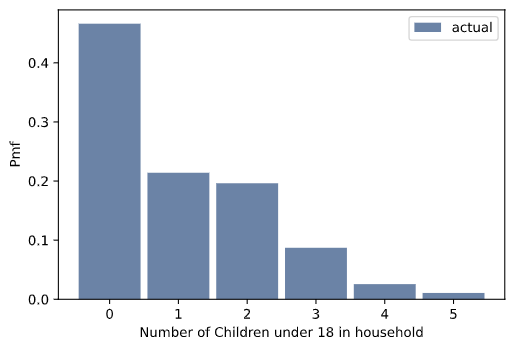

[Think Stats Chapter 3 Exercise 1](http://greenteapress.com/thinkstats2/html/thinkstats2004.html#toc31) (actual vs. biased)

The exersice reads as below:

>**Exercise 3.1** Something like the class size paradox appears if you survey children and ask how many children are in their family. Families with many children are more likely to appear in your sample, and families with no children have no chance to be in the sample.
>
>Use the NSFG respondent variable NUMKDHH to construct the actual distribution for the number of children under 18 in the household.
>
>Now compute the biased distribution we would see if we surveyed the children and asked them how many children under 18 (including themselves) are in their household.
>
>Plot the actual and biased distributions, and compute their means. As a starting place, you can use chap03ex.ipynb.

---

#### Q1: Use the NSFG respondent variable NUMKDHH to construct the actual distribution for the number of children under 18 in the household.

First, I plotted a histogram of raw number of children.

```{python}
hist = thinkstats2.Hist(resp.numkdhh, label='numkdhh')
thinkplot.Hist(hist)
thinkplot.Config(xlabel='Number of children under 18 in household', ylabel='Count')
```

Output:


Then I represented the values as percentages of the full data set using the pmf.

```{python}
pmf = thinkstats2.Pmf(resp.numkdhh, label='actual')
for key, val in pmf.Items():
    print(f"{key}: {round(val,2)}")
print(f"Total: {pmf.Total()}")
```

Output:

>0: 0.47 \
>1: 0.21 \
>2: 0.2 \
>3: 0.09 \
>4: 0.03 \
>5: 0.01 \
>Total: 1.0

And plotted that as well.

```{python}
thinkplot.Hist(pmf)
thinkplot.Config(xlabel='Number of Children under 18 in household', ylabel='Pmf')
```

Output:



---

#### Q2: Now compute the biased distribution we would see if we surveyed the children and asked them how many children under 18 (including themselves) are in their household.

```{python}
biased_pmf = BiasPmf(pmf, label='observed')
for key, val in biased_pmf.Items():
    print(f"{key}: {round(val,2)}")
print(f"Total: {biased_pmf.Total()}")
```
Output:
>0: 0.0 \
>1: 0.21 \
>2: 0.38 \
>3: 0.26 \
>4: 0.1 \
>5: 0.05 \
>Total: 1.0

---

#### Q3: Plot the actual and biased distributions, and compute their means. As a starting place, you can use chap03ex.ipynb.

Plotting actual and biased distributions:

```{python}
thinkplot.PrePlot(2)
thinkplot.Pmfs([pmf, biased_pmf])
thinkplot.Config(xlabel='Number of Children under 18 in Household', ylabel='PMF')
```
Output:


Computing means:
```{python}
print(f'Actual pmf mean: {pmf.Mean()}')
print(f'Biased pmf mean: {biased_pmf.Mean()}')
```

Output:

>Actual pmf mean: 1.024205155043831 \
>Biased pmf mean: 2.403679100664282

We can see the oversampled biased set shows a higher average of children in the household when compared to actual.
