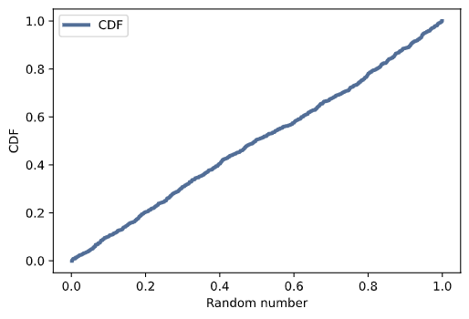

[Think Stats Chapter 4 Exercise 2](http://greenteapress.com/thinkstats2/html/thinkstats2005.html#toc41) (a random distribution)

The exercise is:

>**Exercise 4.2** The numbers generated by random.random are supposed to be uniform between 0 and 1; that is, every value in the range should have the same probability.
>
>Generate 1000 numbers from random.random and plot their PMF and CDF. Is the distribution uniform?

Generate 1000 numbers using `np.random.random`

```{python}
rand = np.random.random(1000)
```

PMF pot:
```{python}
pmf = thinkstats2.Pmf(rand, label='pmf')
thinkplot.pmf(pmf)
thinkplot.Config(xlabel='Random number', ylabel='PMF')
```
Output:


CDF plot:

```{phython}
cdf = thinkstats2.Cdf(rand, label='CDF')
thinkplot.Cdf(cdf)
thinkplot.Config(xlabel='Random number', ylabel='CDF', loc='upper left')
```

Output:



Yes, the distribution is uniform. The probablity of choosing any random number is the same throughout.
